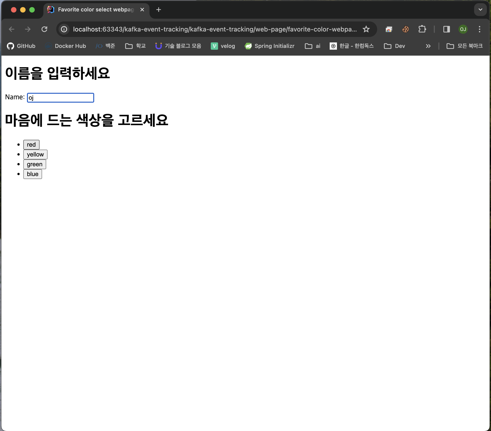

# Personal Tech Practice Demos

# Demo

## 📕 Spring Cloud Config Demo
[read me](/spring-cloud-config-demo/README.md)
[source code](/spring-cloud-config-demo/)

## 📙 Kafka Event Tracking
사용자의 색 선택 이벤트를 추적하여 kafka로 적재하고, 이를 hadoop과 elastic search로 적재하고, 키바나로 시각화
[read me](/kafka-event-tracking/README.md)
[source code](/kafka-event-tracking/)

# Practice

## 📗 Kafka Client Practice
[source code](/kafka-client-first-practice/)

## 📘 Kafka Streams Practice
[source code](/KafkaStreams/)