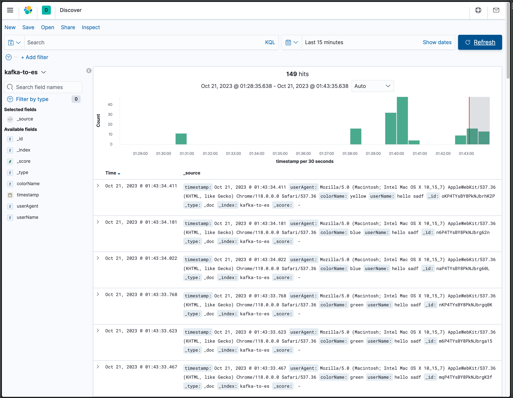

# 주제
사용자의 행동을 트래킹하여 적재하는 예제

이름을 입력하고 자신이 좋아하는 색상을 고르는 버튼을 누르면,
해당 이벤트와 유저정보를 카프카 토픽으로 전달하고,
최종적으로 하둡과 엘라스틱 서치에 적재되는 것을 목표로 한다.

# 파이프라인 정책
우선 파이프 라인 정책을 결정한다.

사용하는 카프카 버전에서는 멱등성 프로듀서를 지원하므로 정확히 한번 전달을 보장할 수 있다.

하지만 적재는 정확히 한번 전달을 위해서는 유니크 키를 활용하던지 해야한다.

이번 프로젝트 특성상 다음과 같은 정책을 적용한다.
- 일부 데이터의 유실 또는 중복 허용
- 안정적으로 끊임없는 적재
- 감작스럽게 발생하는 많은 데이터 양을 허용
- 이벤트 수집의 경우 일부 유실을 허용한다

# 데이터 포맷 - json
디버깅의 편리함, 스키마 변경에 따른 비용을 고려하여 Json 으로 포맷을 정한다. 

# 프로듀서 정책
## ack option
일부 유실이나 중복이 발생하더라도, `안정적이고 빠른` 파이프라인을 구축하는 것이 목표이므로,
`acks=1` 옵션을 사용한다.

## 최소 동기화(min.insync.replicas)
`acks=1` 옵션에서는 팔로워에 대한 체크를 하지 않으므로, 이 옵션은 무시된다.

## 파티셔너
이번 이벤트의 경우 특별히 파티션을 분류할 필요가 없으므로, 기본 파티셔너인, UniformStickyPartitioner 를 사용한다.

## 재시도 설정
재시도를 하게되면, 데이터 중복이나 순서가 뒤바뀔 수 있다.

여기서는 중복이나 순서 뒤바뀜을 허용하기 때문에 기본 설정을 사용한다.

## 프로듀서 압축 설정
압축을 하면, 데이터의 용량을 줄이고, 네트워크의 사용량을 줄이는데 효과적이다. 
하지만 그만큼 처리량이 떨어지고, cpu 사용량이 늘어난다.

이번 프로젝트는 처리량이 많지 않고, 실습용이기 때문에 압축을 사용하지 않는다.

# 토픽
## 파티션 갯수
데이터의 처리 순서를 지켜야한다면 파티션의 갯수를 엄격하게 결정해야한다.

하지만, 시간을 조합해서 보낸다면, 조회 시점에서 순서를 보장할 수 있고, 처리(적재) 순서는 중요하지 않으므로,
2개 이상의 파티션으로 엄격하지 않게 가져간다.

## 메시지 키 사용 여부
커스텀 파티셔너를 사용하지 않는다면 키를 사용하여 파티셔닝을 진행한다.

만약 키를 사용한다면 파티션의 갯수가 늘어난다면, 키와 해시값 사이의 매칭이 깨지며, 
만약 특정 파티션에 의존하는 컨슈머를 운영한다면 상당히 곤란해진다.

여기서는 메시지 값에만 데이터를 저장하고 메시지 키에는 저장하지 않는다. 
이렇게 하면 데이터의 양에 따라 파티션의 개수를 가변적으로 설정할 수 있다.

## 복제 개수
여기서는 최소 설정인 2로 설정한다.

# 시연

